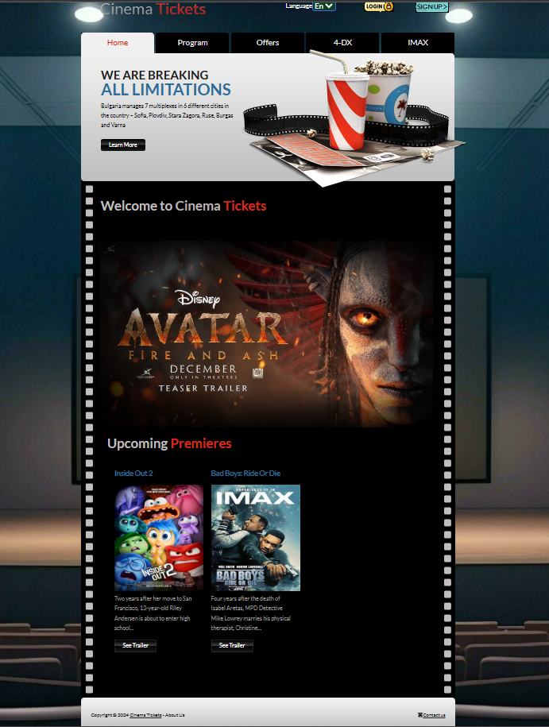
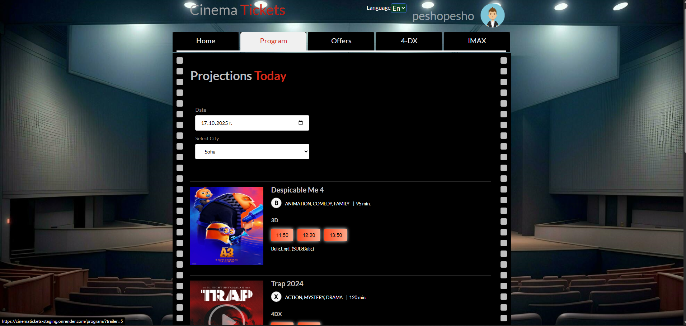
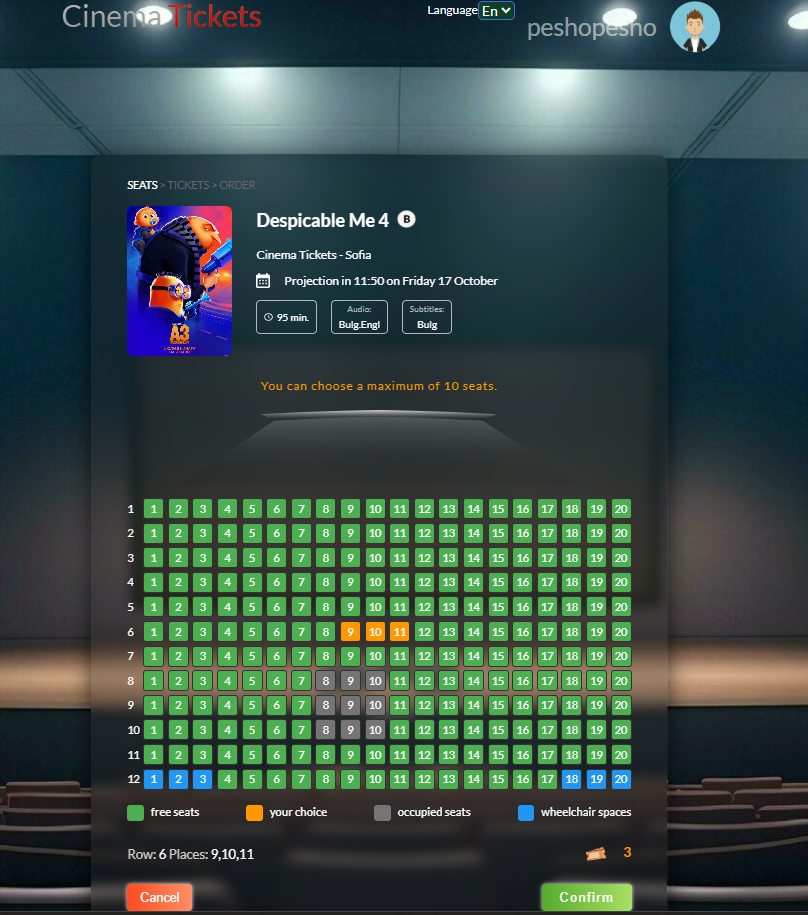
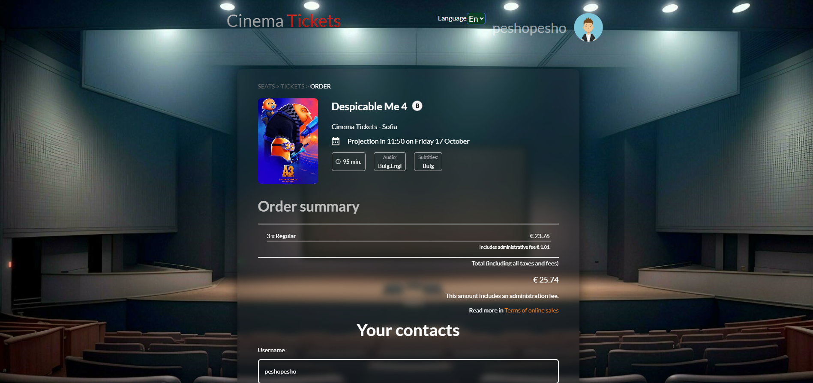
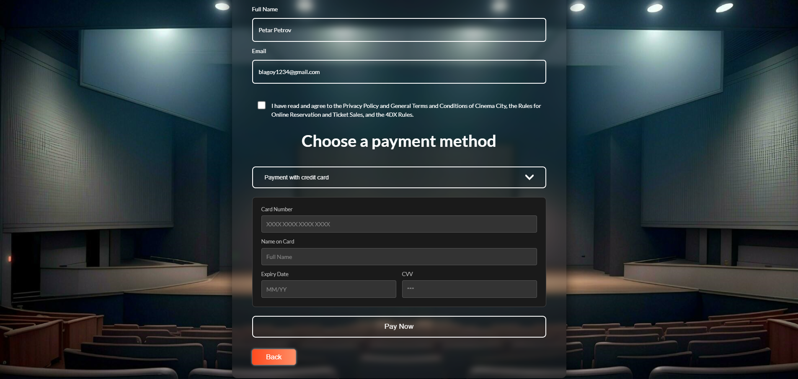
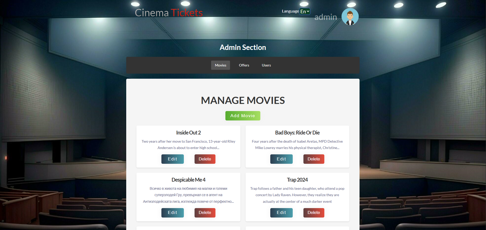
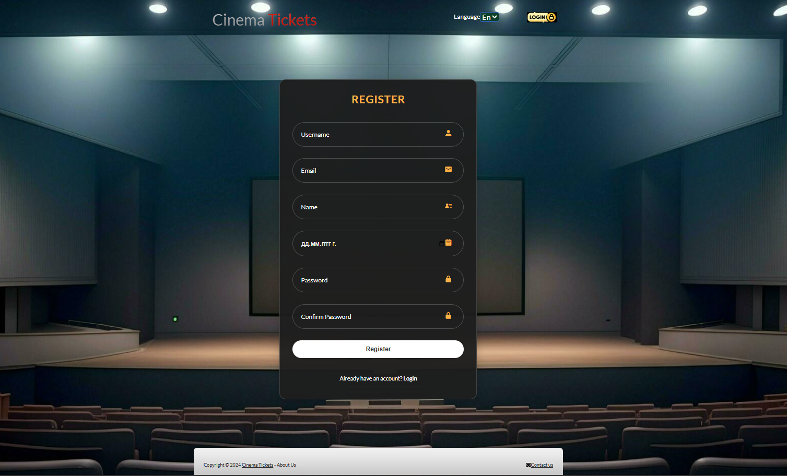
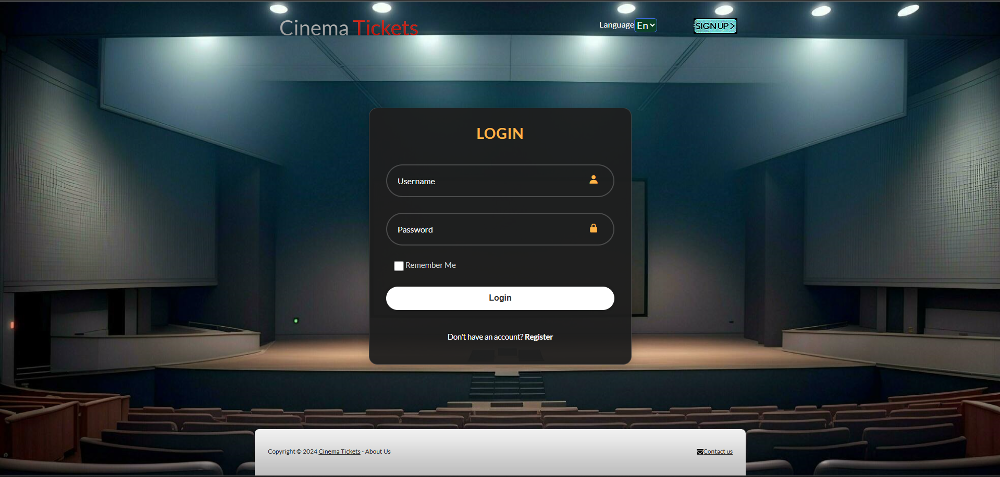
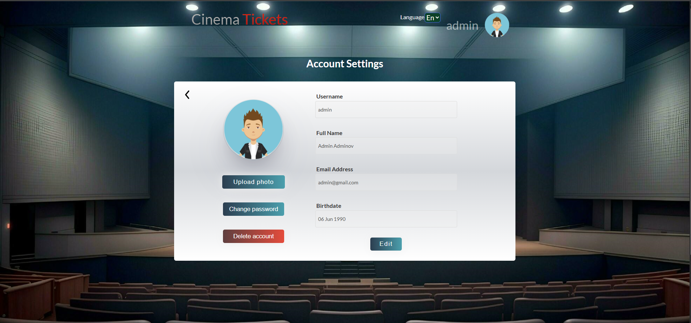
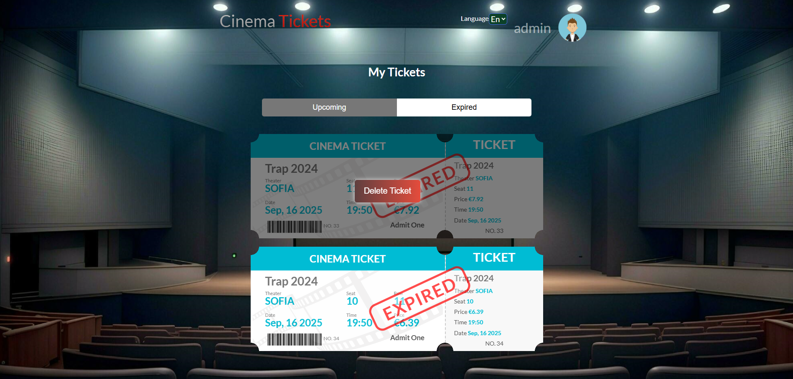

## 🎬 Cinema Tickets – Frontend (React + Vite)

This is the React frontend for the Cinema Tickets system. It consumes two backend services implemented as microservices:

- Main backend for users/orders/tickets/offers: `Main-Spring-API` ([GitHub](https://github.com/BlagoyVelinov/Spring-Project))
- Movies backend for catalog and CRUD: `Movies-Spring-API` ([GitHub](https://github.com/BlagoyVelinov/Spring-Project-REST-API))

The frontend powers the client-facing experience: browse movies, select projection, pick seats and ticket types, place orders and pay, plus authentication screens and admin capabilities.

---

## 🧭 What this project includes

- **Movie catalog**: listings, details, upcoming premieres (via Movies API)
- **Reservation and purchase**: choose date/time/hall, seats, ticket types, order summary and payment
- **Users and profiles**: register, login/logout, view and edit profile (via Main Backend API)
- **Admin features**: manage movies (CRUD), offers and users (requires appropriate roles)

---

## 🧩 Architecture (short)

- Frontend (this project, React + Vite)
- Main Backend (Spring-Project-API) – authentication, users, orders, tickets, offers – see `Main-Spring-API` [GitHub](https://github.com/BlagoyVelinov/Spring-Project)
- Movies Backend (Spring-Project-REST-API) – movie catalog (CRUD) – see `Movies-Spring-API` [GitHub](https://github.com/BlagoyVelinov/Spring-Project-REST-API)

The app expects both backends to be available at configurable URLs (see “Environment variables”).

---

## 🖼️ Screenshots












---

## 🔧 Environment variables (.env)

Create a `.env` (or `.env.local`) file at the project root with the backend base URLs:

```env
# Main Backend (Users/Orders/Tickets/Offers)
VITE_CINEMA_BASE_URL=http://localhost:8080
# Optional (if you use a hosted/cloud backend)
# VITE_CINEMA_AZURE_BASE_URL=https://<your-main-backend-deploy>

# Movies Backend (Movies CRUD/Catalog)
VITE_MOVIES_BASE_URL=http://localhost:8081
# Optional (if you use a hosted/cloud backend)
# VITE_MOVIES_AZURE_BASE_URL=https://<your-movies-backend-deploy>
```

The frontend prioritizes `VITE_*_AZURE_BASE_URL` when set; otherwise it uses `VITE_*_BASE_URL`.

---

## ▶️ Run locally

1. Install dependencies:
   ```bash
   npm install
   ```
2. Start in dev mode:
   ```bash
   npm run dev
   ```
3. Production build:
   ```bash
   npm run build
   npm run preview
   ```

Make sure both backends are running and match the URLs configured in `.env`.

---

## 🗄️ Backend services (overview)

- Main Backend – `Spring-Project-API` (users, orders, tickets, offers)
  - Code and docs: [GitHub – Spring-Project-API](https://github.com/BlagoyVelinov/Spring-Project)
  - Docker image: `docker pull blagoyvelinov/cinema-tickets`  
    See details in the backend README.
  - Note: Uses Mailjet for email verification on registration — configure environment variables as per backend docs.

- Movies Backend – `Spring-Movies-REST-API` (movies: add, list, update, delete)
  - Code and docs: [GitHub – Spring-Movies-REST-API](https://github.com/BlagoyVelinov/Spring-Project-REST-API)
  - Docker image: `docker pull blagoyvelinov/cinema-tickets-movies`  
    See details in the backend README.

---

## 🔐 Authentication & session (short)

- Login/Register go to the Main Backend (`/users/login`, `/users/register`).
- On success, the token is stored in `localStorage` and used as `Authorization: Bearer <token>` for protected requests.
- On 401/403 the frontend clears the token and redirects to the login screen.

---

## 🧾 Ticket ordering – user flow

1. Choose movie and projection (date/time/location)
2. Select seats in the hall (validations for occupied/wheelchair seats)
3. Choose ticket types (children/students/60+/regular)
4. Review order summary and confirm
5. Pay by card (form validation)
6. Create order via Main Backend and redirect to success screen

---

## 🧪 Useful commands

- Lint (if configured): `npm run lint`
- Tests (if available): `npm test`

---

## 🖼️ More screenshot












---

## 📚 References

- Main Backend – Main-Spring-API: [GitHub](https://github.com/BlagoyVelinov/Spring-Project)
- Movies Backend – Movies-Spring-API: [GitHub](https://github.com/BlagoyVelinov/Spring-Project-REST-API)

---

## ⚠️ Notes

- For email verification (registration), configure Mailjet keys and sender in Main Backend (see its README).
- If you run the backends with Docker, follow their repository instructions.
